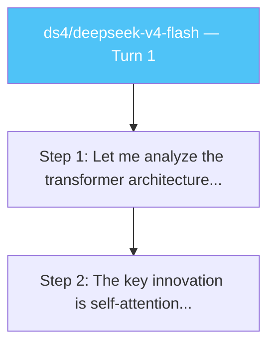

# 🧠 Reasoning Trace Visualizer

> Capture, compare, and analyze LLM thinking/reasoning traces across models and providers.

A [pi](https://pi.dev) extension that eavesdrops on your LLM's internal reasoning and gives you tools to study it.

## Why

Understanding *how* models think is the frontier. This tool lets you:

- **Capture** the hidden reasoning chains models generate before responding
- **Compare** how different models (DeepSeek, Claude, Gemini, etc.) approach the same problem
- **Visualize** reasoning paths as Mermaid flowcharts
- **Export** structured data for research papers or blog posts

## Quick Start

```bash
# Option 1: Clone and use locally
git clone <this-repo> ~/reasoning-trace-viz
cd ~/reasoning-trace-viz

# Option 2: Install as a pi package
pi install /path/to/reasoning-trace-viz
```

Then load the extension:

```bash
# Via CLI
pi -e ~/reasoning-trace-viz/extensions/index.ts

# Or add to .pi/settings.json
echo '{"extensions": ["/path/to/reasoning-trace-viz/extensions/index.ts"]}' > .pi/settings.json
```

Reload: `/reload` in pi

## Commands

| Command | Description |
|---------|-------------|
| `/thinking-log [filter]` | List all captured traces (with optional text filter) |
| `/thinking-stats` | Statistics — count, tokens, per-model breakdown |
| `/thinking-export` | Export all traces as structured markdown |
| `/thinking-compare [a] [b]` | Compare reasoning patterns between models |
| `/thinking-diagram [filter]` | Generate a Mermaid flowchart from reasoning steps |
| `/thinking-viz [filter]` | Interactive TUI browser for traces |
| `/thinking-blog` | Auto-generate a blog-ready analysis post |
| `/thinking-clear` | Clear all captured traces |
| `/thinking-sessions` | List all sessions with thinking traces |
| `/thinking-aggregate` | Aggregate traces from ALL sessions, cross-model analysis |
| `/thinking-dashboard` | Generate standalone HTML dashboard with search/charts/timeline |
| `/thinking-patterns [filter]` | Classify reasoning patterns (deductive, inductive, abductive, etc.) |

## Workflow

1. **Start pi** with the extension loaded → footer shows `🧠 0 traces`
2. **Ask complex questions** — the extension captures thinking blocks automatically:
   - `"Explain how transformers work"`
   - `"Debug this code: ..."`
   - `"Compare attention mechanisms"`
3. **Explore traces** — `/thinking-log`, `/thinking-stats`
4. **Compare models** — switch models and ask the same question, then `/thinking-compare`
5. **Visualize** — `/thinking-diagram` generates a Mermaid chart
6. **Publish** — `/thinking-export` or `/thinking-blog`

## Quick Reference

### How the current project references it

```json
// .pi/settings.json
{
  "extensions": ["/project/inniang/reasoning-trace-viz/extensions/index.ts"]
}
```

### How to use it right now

```
/reload                          # Load the extension
Ask a complex question...        # Extension captures thinking blocks
/thinking-log                    # View traces
/thinking-compare modelA modelB  # Compare models (after using different models)
/thinking-diagram                # Generate Mermaid flowchart
/thinking-viz                    # Interactive TUI viewer
/thinking-export                 # Export for blog
/thinking-blog                   # Auto-generate blog post
/thinking-stats                  # Show statistics
/thinking-clear                  # Clear all traces
/thinking-sessions               # List all sessions with traces
/thinking-aggregate              # Full cross-session aggregated report
/thinking-dashboard              # Open HTML dashboard in browser
/thinking-patterns               # Classify reasoning patterns
```

### Testing Checklist

Run these commands in order to validate the extension is working:

| Step | Command | What to expect |
|------|---------|----------------|
| 1 | `/thinking-log` | Both traces listed in editor |
| 2 | `/thinking-log gradient` | Only traces mentioning "gradient" |
| 3 | `/thinking-stats` | Count, token estimates, models used |
| 4 | `/thinking-viz` | Interactive TUI — navigate with ↑↓, `/` to search, Enter to view, Esc to exit |
| 5 | `/thinking-diagram` | Mermaid flowchart generated in editor |
| 6 | `/thinking-export` | Full structured markdown export |
| 7 | `/thinking-blog` | Blog-ready analysis post |
| 8 | `/thinking-clear` | Clears all traces (asks for confirmation) |
| 9 | `/thinking-sessions` | Lists all sessions that have traces, with counts |
| 10 | `/thinking-aggregate` | Full cross-session aggregated report with model comparison, timeline, distribution |
| 11 | `/thinking-dashboard` | Opens a standalone HTML dashboard in your browser |
| 12 | `/thinking-patterns` | Classifies each trace's reasoning strategy (deductive, inductive, etc.) |

## Examples

### Viewing traces

```
/thinking-log attention
```

Lists all traces whose thinking content contains "attention".

### Comparing two models

```
/thinking-compare deepseek claude
```

Shows a side-by-side comparison of thinking length, token count, step structure, focus keywords, and sample text.

### Generating a diagram

```
/thinking-diagram
```

Produces Mermaid markup like:



Paste into [mermaid.live](https://mermaid.live) to render.

## Architecture

```
┌──────────────────────────────────────────────────┐
│  pi session                                      │
│  ┌────────────────────────────────────────────┐  │
│  │ Extension: Reasoning Trace Visualizer      │  │
│  │                                            │  │
│  │  message_end ──► extract thinking blocks   │  │
│  │       │                                     │  │
│  │       ▼                                     │  │
│  │  pi.appendEntry("thinking-trace", data)     │  │
│  │       │                                     │  │
│  │       ▼                                     │  │
│  │  In-memory: traces[] array                  │  │
│  │       │                                     │  │
│  │  Commands: log, stats, compare, diagram     │  │
│  └────────────────────────────────────────────┘  │
└──────────────────────────────────────────────────┘
```

- **Persistence**: traces survive session restarts via `pi.appendEntry()`
- **Cross-session**: traces accumulate across `/new` and `/resume` in the same project
- **Multi-model**: works with any provider that emits `thinking` content blocks

## Building SOTA Features

This is a foundation. Ideas for next steps:

- [ ] **Interactive TUI Viewer** — browse traces with keyboard navigation, full preview pane
- [ ] **Diagram Generator** — convert reasoning chains to Mermaid flowcharts
- [ ] **Web UI** — Export traces to a local web dashboard with interactive graphs
- [ ] **Pattern detection** — Automatically classify reasoning strategies (deductive, inductive, abductive)
- [ ] **Benchmark integration** — Pair with eval frameworks to correlate thinking patterns with accuracy
- [ ] **Token-level heatmaps** — Visualize which parts of the thinking were most "effortful"
- [ ] **Cross-session aggregation** — Compare thinking patterns across different problem types
- [ ] **Thinking-to-code** — Extract code that was reasoned about during thinking

## Requirements

- pi >= 0.74.0
- A model that supports thinking/reasoning blocks (DeepSeek v4, Claude Sonnet 4, Gemini 2.5, etc.)

## License

MIT
